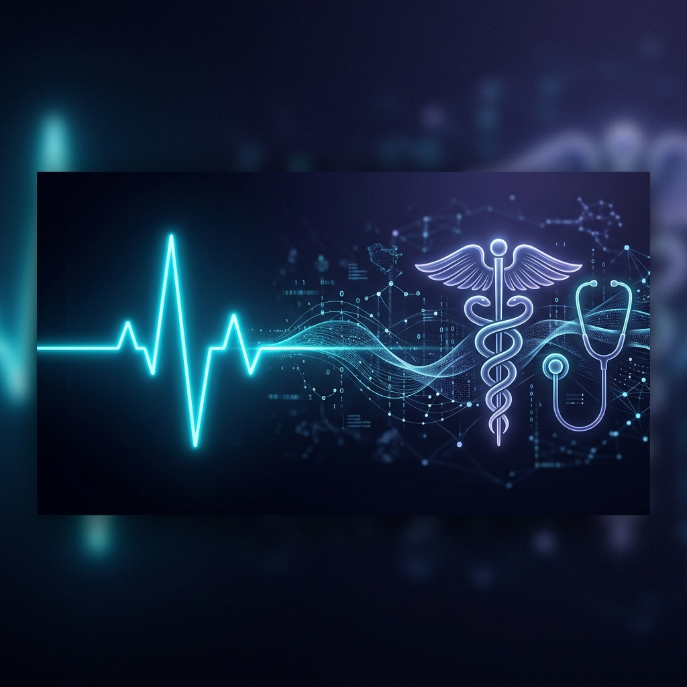
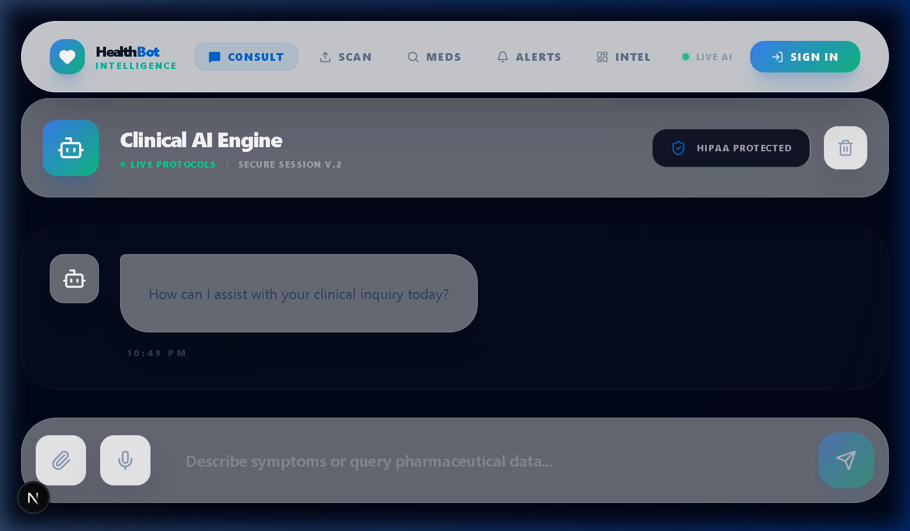
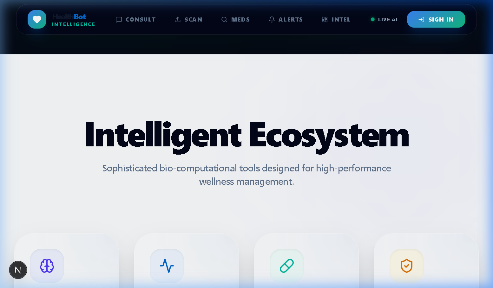

# <p align="center">🧬 HealthBot AI: The Clinical Future</p>

<p align="center">
  
</p>

<p align="center">
  <strong>Next-generation Bio-Intelligence for modern healthcare management.</strong>
</p>

<p align="center">
  <a href="https://github.com/K-Deepak1610/HealthBot/stargazers"></a>
  <a href="https://github.com/K-Deepak1610/HealthBot/network/members"></a>
  <a href="https://github.com/K-Deepak1610/HealthBot/blob/main/LICENSE"></a>
</p>

---

## 🌟 Vision

HealthBot AI is an enterprise-grade **Medical AI SaaS** platform designed to revolutionize the way individuals interact with their personal healthcare data. Experience clinical-grade diagnostic precision and pharmaceutical insights at the speed of thought, powered by advanced neural triage and biometric telemetry.

---

## 🚀 Intelligent Ecosystem

HealthBot is not just a chatbot; it's a sophisticated bio-computational toolset designed for high-performance wellness management.

### 🧠 Bio-Triage AI
Predictive analysis for over **800+ symptoms** with clinical accuracy. Engage in deep-linked consultations with our Clinical AI Engine.


### 📸 Pharm-Vision (OCR)
Revolutionary prescription scanning. Effortlessly extract medication data from physical prescriptions using **Tesseract OCR** and **Llama 3.1** bio-intelligence.


### 📊 Health Matrix
A high-resolution dashboard for your biometric telemetry. Track trends, monitor vitals, and visualize your clinical journey in real-time.

---

## 🛠️ Bio-Stack Architecture

| Layer | Technology |
| :--- | :--- |
| **Interface** | Next.js 15+, TypeScript, Tailwind CSS, Framer Motion |
| **Logic** | FastAPI (Python 3.10+), SQLAlchemy |
| **Intelligence** | NVIDIA NIM (Llama 3.1), Tesseract OCR |
| **Vault** | SQLite with Alembic Migrations |
| **Security** | Quantum-Resistant Encryption Protocols |

---

## ⚙️ Protocol Initialization

Follow these steps to deploy HealthBot AI in your local environment:

### **1. Neural Interface (Frontend)**
```bash
cd frontend
npm install
npm run dev
```

### **2. Clinical Core (Backend)**
```bash
cd backend
python -m venv venv
source venv/bin/activate # or .\venv\Scripts\activate
pip install -r requirements.txt
python -m app.main
```

---

## 🛡️ Clinical Integrity

HealthBot AI prioritizes diagnostic safety. All insights are grounded in established clinical research and FDA-synched medicinal synthesized data. **Warning: HealthBot is for educational insights and triage; always consult a licensed medical professional for emergencies.**

---

<p align="center">
  
  <br>
  Built with Clinical Passion by <a href="https://github.com/K-Deepak1610">K-Deepak</a>
</p>
